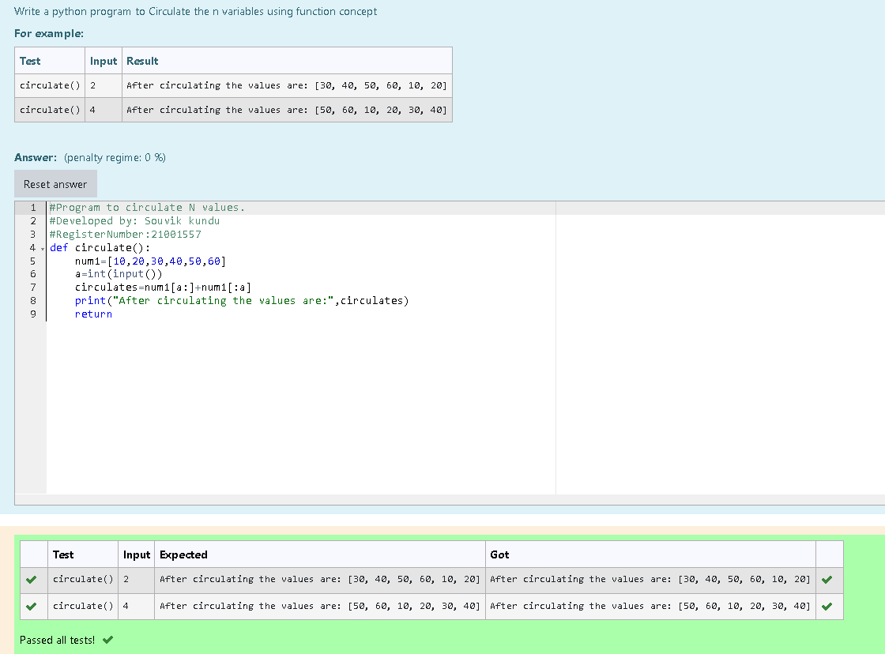

# Circulate-the-values-of-N-variables
## Aim:
To write a python program to circulate the n variables using function concept
## Equipment’s required:
PC
Anaconda - Python 3.7
## Algorithm: 
### Step 1:

 Define the function

### Step 2: 

Get the value from the user for the list

### Step 3: 

Get the value from the user for the number of rotation

### Step 4: 

Using the slicing concept rotate the list

### Step 5: 

Print the circulated list

### Step 6:

End the program 

## Program:
~~~
#Program to circulate N values.
#Developed by: Souvik kundu
#RegisterNumber:21001557
def circulate():
    num1=[10,20,30,40,50,60]
    a=int(input())
    circulates=num1[a:]+num1[:a]
    print("After circulating the values are:",circulates)
    return
~~~

## Output:

## Result:
Thus the values inside the list are successfully circulated
